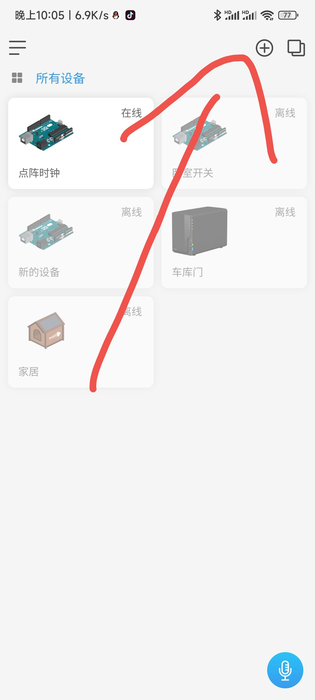
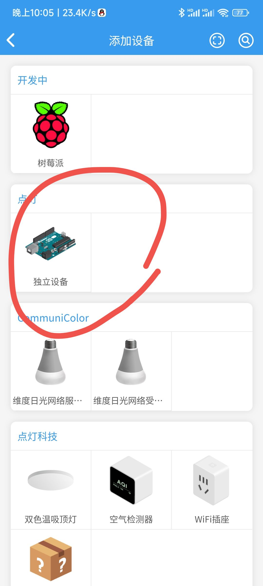
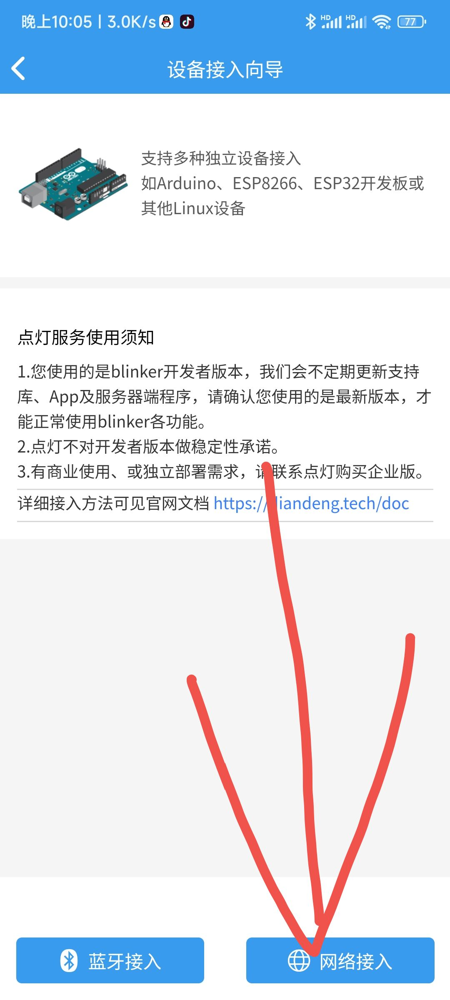
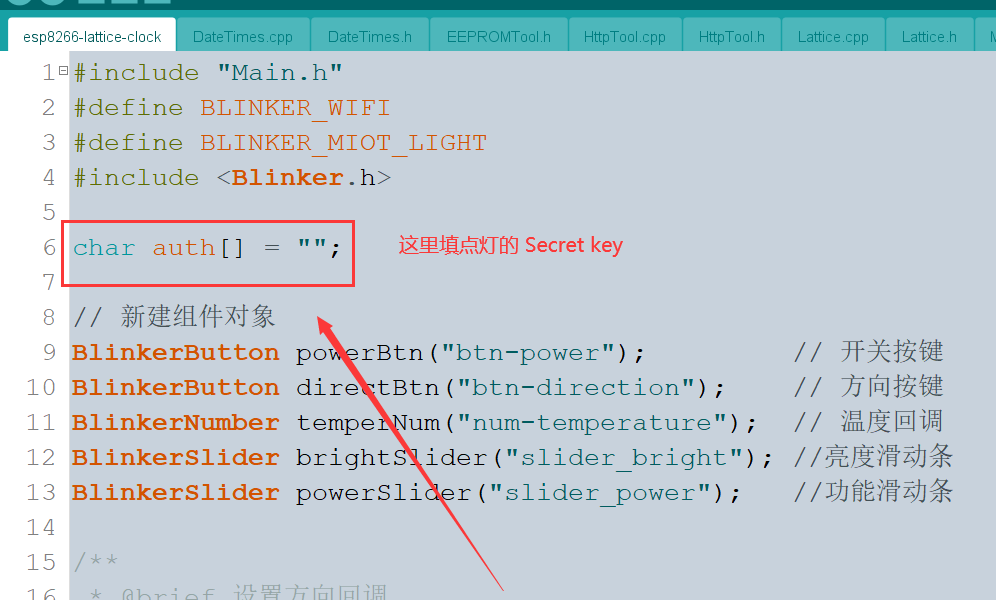
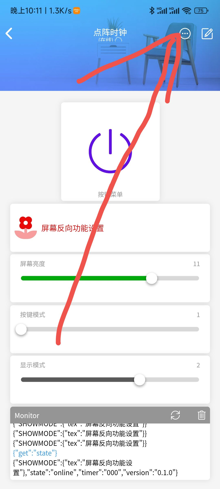
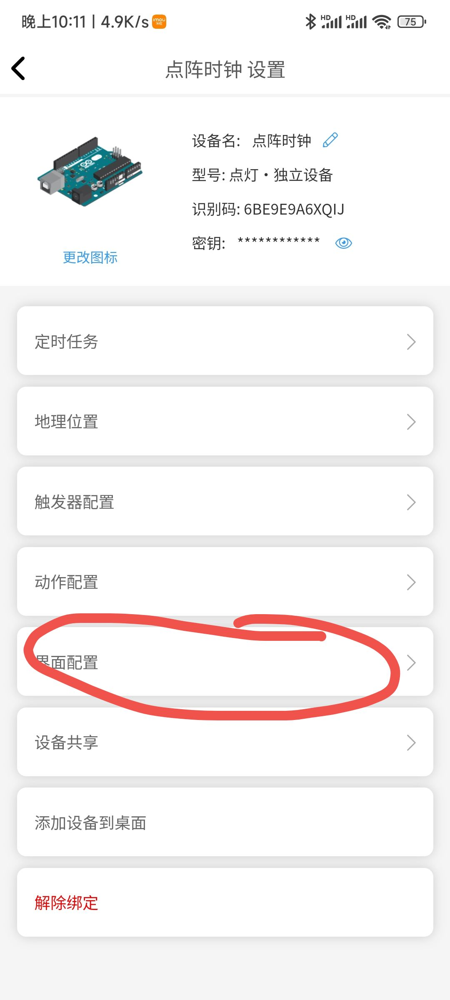
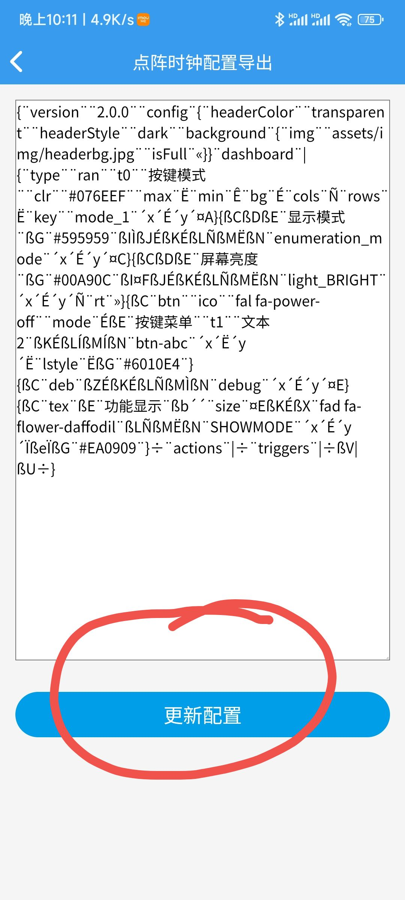

# 点阵时钟 - 接入点灯版本说明

## 序

此版本为体验版本，后续不做过多更新操作，有兴趣的欢饮自己手动开发，这里只做基本的说明

## 使用说明

### 1. 注册点灯程序获取 Secret key









### 2. 修改代码

将第一步获取的点灯``Secret  key`` 放在下图代码处 



### 3. 写入程序

这个应该都懂，不懂请参考 [https://gitee.com/lengff/esp8266-lattice-clock-open](https://gitee.com/lengff/esp8266-lattice-clock-open)


### 4. 导入点灯的操作界面

界面代码如下：

```
{¨version¨¨2.0.0¨¨config¨{¨headerColor¨¨transparent¨¨headerStyle¨¨dark¨¨background¨{¨img¨¨assets/img/headerbg.jpg¨¨isFull¨«}}¨dashboard¨|{¨type¨¨btn¨¨ico¨¨fal fa-power-off¨¨mode¨Ê¨t0¨¨熄屏¨¨t1¨¨文本2¨¨bg¨É¨cols¨Ë¨rows¨Ë¨key¨¨btn-power¨´x´É´y´Ë¨lstyle¨Ê}{ßCßDßEßFßGÊßH¨显示方向¨ßJßKßLÉßMËßNËßO¨btn-direction¨´x´É´y´ÍßQÊ}{ßC¨ran¨ßH¨功能切换¨¨clr¨¨#389BEE¨¨max¨Î¨min¨ÉßLÉßMÏßNËßO¨slider_power¨´x´Ë´y´ÍßQͨrt¨»}{ßCßTßH¨设置亮度¨ßVßWßX¤FßYÉßLÉßMÏßNËßO¨slider_bright¨´x´Ë´y´ËßQÍßa»}÷¨actions¨|÷¨triggers¨|÷ßa|ßZßc÷}
```

操作步骤如下：







### 5. 结束


## 绑定小爱同学

### 1.打开米家App。通过 **我的>其他平台设备>点击添加>点灯科技>绑定账号** ，绑定blinker账号
### 2.绑定成功后，支持小爱控制的blinker设备会出现在 **我的>其他平台设备>点灯科技** 设备列表中
### 3.现在可以使用小爱控制该设备了
