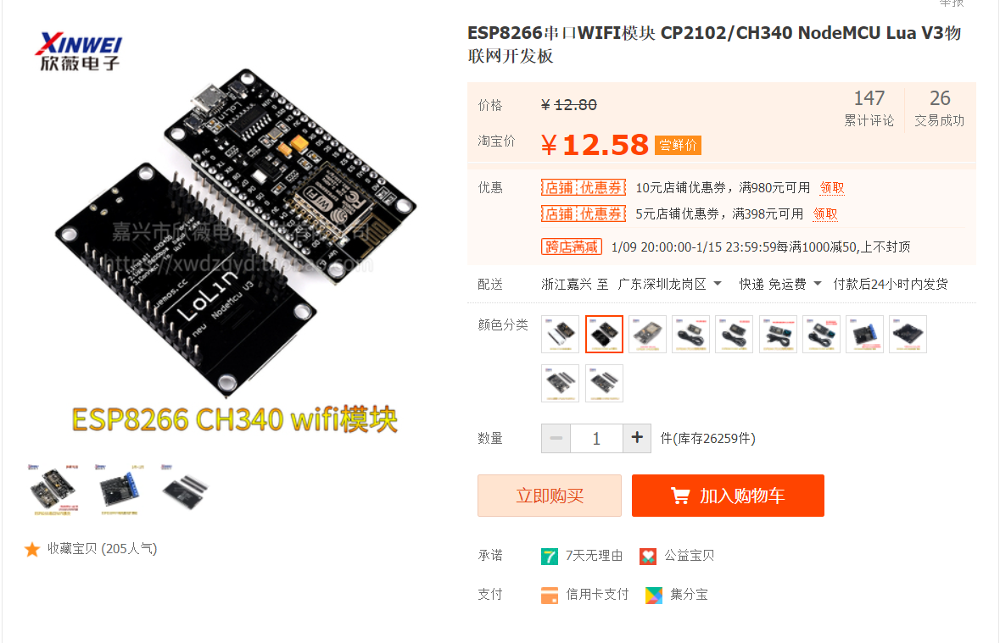
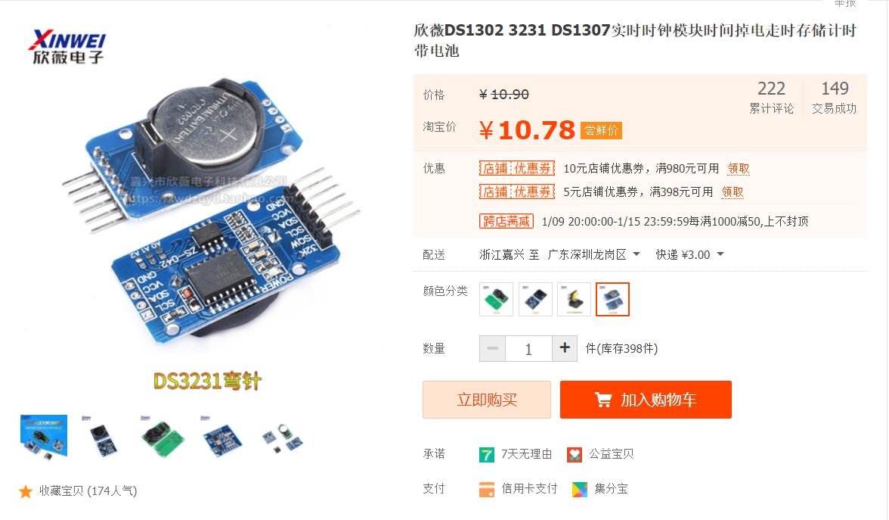
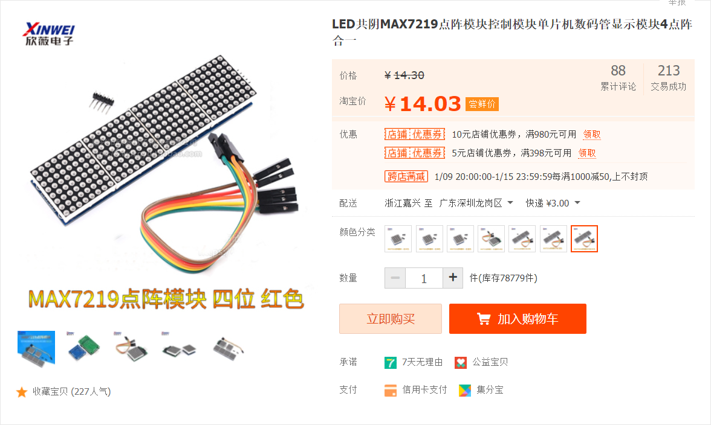
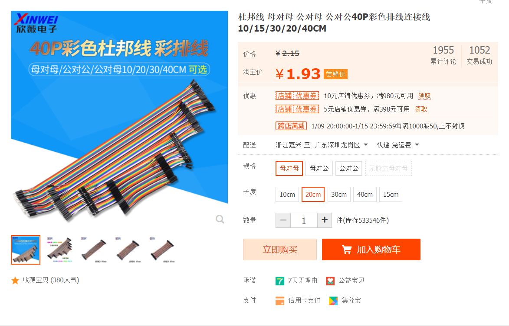
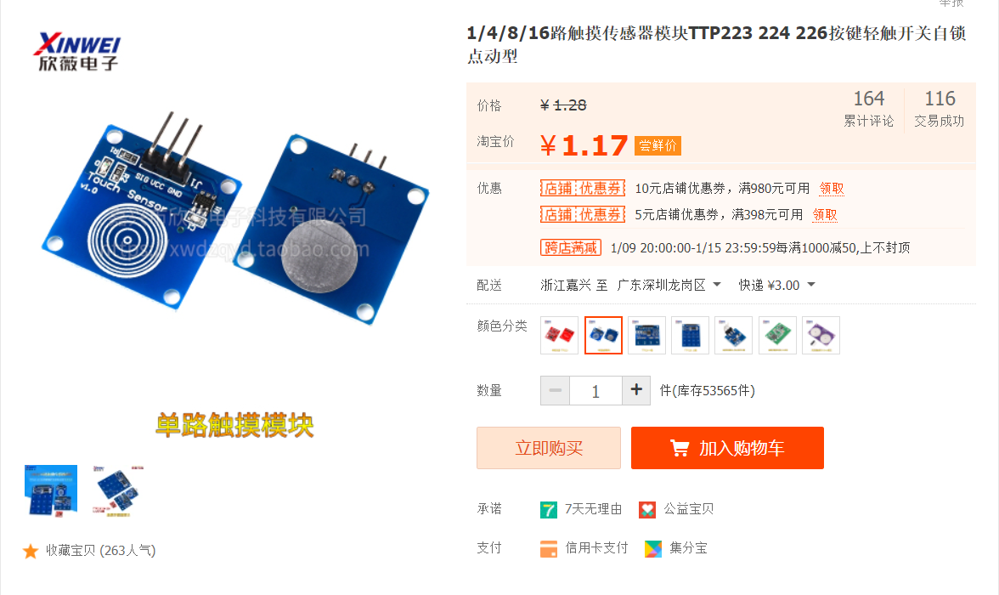
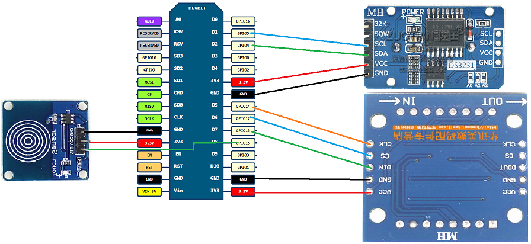
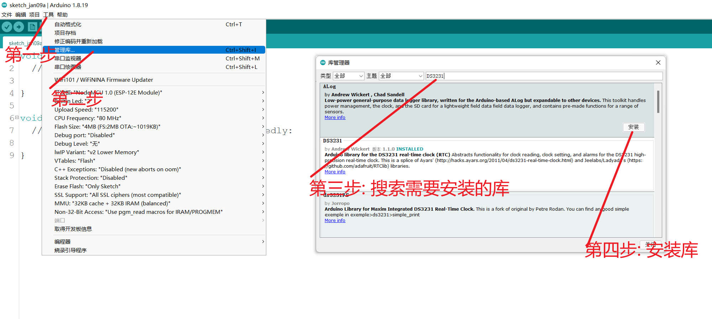
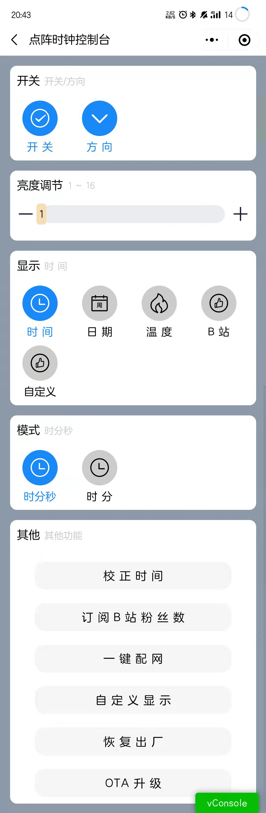

# 原文地址

[多功能点阵时钟](http://blog.lengff.com/2022/01/17/project-lattice-clock/)

# 简介

很早就了解ESP8266了，当时也用这个搞过一些小demo，一直也没有想过要弄些实际的作品出来，也许是因为自己比较菜吧！最近刚好工作上没那么忙， 想着自己重新搭建一个mqtt服务器，做一些和物联网有关的功能。逛论坛的时候有一篇帖子吸引到我了，就是这篇 《 [ESP8266物联网创意点阵时钟，女朋友看了都想要！](https://www.arduino.cn/thread-98790-1-1.html) 》让我萌生了自己搞一个点阵时钟的想法，所以就一点一点的开始了这个制作点阵时钟的制作旅程，过程谈不上很难，但是中途也遇到了很多的问题，中途遇到了很多的问题，有些解决了，有些就只能简单粗暴的解决，好在最终还是能够实现自己所想的功能。 总结经验和教训想分享给有同样兴趣爱好的人，文笔不太好，代码也写的不好，但依旧阻挡不了这颗分享的心。

# 演示

## 图片


## 视频

[点击跳转接哔哩哔哩查看](https://www.bilibili.com/video/BV18i4y1R7ft?spm_id_from=333.999.0.0)

# 理念

尽管网上有很多人都搞过或正在`esp8266`的点阵时钟，我重复搞更像是在造轮子，我作为一个开发者也很抵制重复造轮子的行为。 但是作为一个初学者的我更想去体验这个造轮子的过程，而且在这个过程中我希望这个轮子有更多我个人的想法在里面，所以就想着自己从头开始来搞这个东西。至于我个人的理念就是做一个极简的点阵时钟出来， 在拥有更多其他的功能之外，要满足它最最核心的功能（时钟，误差低），其次就是拥有更多的功能，更简单的交互，再者就是成本要低，希望想自己``diy``的人用最低的成本做一个好看又好用的点阵时钟出来。

- 简单
- 好用
- 功能丰富
- 低成本

# 硬件选材

这里我就只介绍一些必要的硬件，懂得都懂就不需要我这种小白列举了。在这里我也放上我一直逛的一家淘宝店：[[欣薇电子科技](https://xwdzqyd.taobao.com/)](https://xwdzqyd.taobao.com/) 。不是打广告，主要是里面东西比较全面，且价格也差不多，购买东西的时候不需要不同的淘宝店之间换来换去，而且运费也只要3元，一般的这种电子产品店运费都是5-6元的。元器件的具体作用请自行百度，我就不一一赘述。

## NodeMcu(Esp8266)

这是我们的核心硬件，功能很多，可能是今年芯片涨价的缘故吧，这类东西越来越贵了。



## DS3231

买这个模块主要的作用是掉电时间不重置，且时间误差小。



## Max7219 32x8 点阵

点阵的驱动芯片好像有蛮多的，`Max7219`有一个优点就是可以级联。



## 杜邦线若干

买杜邦线是解决焊接的麻烦，可以快速简单的搞出我们需要的电路出来



## 单路触摸模块

原本是搞点动开关的，但是那种成本也不低，体验又不好，所以就买这种触摸模块，用来实现单击，双击，长按等功能，当然这个是非必要的，如果你不想要任何实体交互，只用小程序进行交互的话，就可以忽略此模块。



----

# 时钟功能

### **硬件功能**

- NTP校时
- 调节亮度
- 显示时间
- 显示日期
- 显示温度
- 显示B站粉丝数
- 显示自定义内容
- OTA更新

### **微信小程序功能**

- 同步设备状态
- 设置显示方向
- 设置亮度
- 设置是否显示
- 切换显示内容
- 切换显示模式
- 恢复出厂
- wifi配网
- OTA更新
- 自定义点阵内容

# 原理图

实在是没有作图的天赋，也没有找到比较好的制图工具，只能借助windows自带的画图工具制作一个简单易懂的原理图出来吧，望见谅



- PS: `立创的PCB原理图和PCB打板已经在制作的路上了，带后续更新`

# 制作过程

其实制作过程算是比简单的，主要分以下几步

##  1. 购买元器件

购买器材可参考上文中提到的一些元器件，淘宝上很多淘宝店都是有卖的。

## 2.  安装对应的软件

这里我们主要用到的软件是``arduino`` 很多diy爱好者应该都用过，用过的用户可跳过，也可以接着往下看

### 安装Arduino

通过官网下载``Arduino IDE``，解压后运行``arduino.exe``就表示安装完成了。下载地址如下：

[arduino-1.8.19-windows.zip](https://downloads.arduino.cc/arduino-1.8.19-windows.zip)

如果链接失效，请在 [官网](https://www.arduino.cc/en/software) 自行下载，下载选项选``Windows ZIP file``

### 安装esp8266 SDK

这里我也是直接从论坛搬运的，但是为了方便阅读所以在下面列出来，可以直接按我列出来的步骤来，如果有问题请到 [这里](https://www.arduino.cn/thread-76029-1-1.html) 看看有没有其他的解决方法

1. 打开`Arduino IDE`菜单 > 文件 >首选项，在 **附加开发板管理器网址** 输入框中，填入以下网址：``https://www.arduino.cn/package_esp8266com_index.json``

2. 下载社区打包的``esp8266``安装包，直接运行并解压即可

    - 	SDK下载（44M）：

      蓝凑云分享地址：https://wwi.lanzouo.com/ij4GEyjcz7c   (推荐使用这个)

      阿里云盘地址：https://www.aliyundrive.com/s/QhgGreFTjJb (推荐使用这个)

3. 双击运行即可解压，解压完成后，再打开``Arduino IDE``，即可在 **`菜单栏 --> 工具 --> 开发板`** 中找到你使用的`esp8266`开发板

4. 提示：如果安装过其他版本的esp8266sdk，请先删除，再使用本安装包，删除方法：文件管理器地址栏输入 **%LOCALAPPDATA%/Arduino15/packages**，回车进入，然后**删除**掉其中的**esp8266文件夹**

### 安装串口驱动

NodeMcu有好多种规格，比较常见的是CP2102串口芯片和CH340串口芯片的，所以都需要对应的驱动，下面分享两者的驱动下载地址：

#### **CP2102驱动**

蓝凑云分享地址：https://wwi.lanzouo.com/iU5mcyjdxuj (推荐使用这个)

博客文件地址：[CP210x_Universal_Windows_Driver.zip](file/CP210x_Universal_Windows_Driver.zip)（不推荐这个，上面链接失效可以使用）

#### **CH340驱动**

蓝凑云分享地址：https://wwi.lanzouo.com/iyFTayjdxsh (推荐使用这个)

博客文件地址：[CH34x_Install_Windows_v3_4.zip](file/CH34x_Install_Windows_v3_4.zip) （不推荐这个，上面链接失效可以使用）

- 解压对应的驱动压缩包，然后双击运行对应系统的驱动即可。

- `驱动安装成功以后需要重启电脑`

## 3. 连接对应的线材

这里就是使用杜邦线进行一个简单的连接，如果有大佬愿意也可以通过我画的电路图进行焊接，不过还是推荐先使用杜邦线连接，调试好程序后再进行焊接处理。

#### `NodeMcu`和`Max7219点阵`接线

- VCC → 3.3V (其实这里也可以接5v，如果你想点阵的亮度比较亮的话)

- GND → GND

- DIN → D7

- CS  → D6

- CLK → D5

#### `NodeMcu`和`DS3231模块`接线

- VCC → 3.3V (这里不用接5v，低电压更安全)

- GND → GND

- DIN →  D7

- SDA  → D2

- SCL →  D1

#### `NodeMcu`和`单路触摸模块`接线

- VCC → 3.3V (这里不用接5v，低电压更安全)

- GND → GND

- SIG  → D8

  

## 4. 写入程序

	使用`Arduino`写入程序其实也挺简单的，大致步骤分为如下几步

### 检查

- 简单ESP8266SDK是否安装成功

- 检查串口驱动是否安装成功

### **安装所需要的依赖包**

- 由于我也是初学者，很多都是使用别人的库文件，自己并没有去深入原理的去重写代码，所以我们需要安装一些库文件

- 安装步骤如下：

    - `工具 --> 管理库 --> 搜索我们需要安装的库  --> 点击安装即可`
    

- 需要安装的库文件如下

    - `DS3231` DS3231时钟现成库文件
    - `LedControl` 驱动Max7219点阵的库文件
    - `OneButton` 实现按键单击，双击，长按功能的库
- `如果有遗漏的库，请看报错提示，按错误提示将其中的库安装一下即可`

### **下载源码**

- `github`下载 https://github.com/Lengff/esp8266-lattice-clock-open
- `gitee`下载 https://gitee.com/lengff/esp8266-lattice-clock-open

	通过上面的地址下载我们的源码。  

### **将源码写入Esp8266**

- 通过`Arduino IDE` 打开我们上一步下载好的代码

  `文件 --> 打开 --> 选择源码所在文件夹中.ino后缀的文件`

- 选择开发板

  `工具 --> 开发板 --> ESP8266 --> NodeMcu 1.0`

  

- 选择端口

  `工具 --> 端口 --> 选择我们串口设备对应的端口` 

- 写入程序

  `项目 --> 上传` 或 `点左侧的 → 箭头` （波特率选115200，会快一些）

## 5. 测试&检验

这里列举个人处理过程中遇到比较多的问题：

1. 程序编译失败
   - 编译失败最多的可能就是库文件不存在，或者esp8266的sdk安装有问题，检查一下编译报错的地方即可
   
2. 程序上传失败
   - 上传失败基本就是串口没选对或者开发板没有选对
   
3. 上传成功后不无任何显示
   - 这里就需要检查自己的接线是否正确。（此操作请断开电源后进行）
   
4. 一键配网不成功
   - 配网需要手机和设备在同一个wifi，且wifi是2.4G的wifi
   - 查看点阵显示内容：`no wifi` 表示没有配置过wifi，需要配置wifi；`con wifi` 则表示已经配置过wifi信息了，正在连接wifi，如果需要重新配置wifi的话就需要长按触摸按键6秒重置系统。
   - 配网建议先按`nodeMcu`上的reset按键，再点击手机上的配网
   
5. 配网成功后显示的内容是 `23:59:59`
   - 这个就表示你的DS3231接线有问题，需要检查接线是否正确。（此操作请断开电源后进行）
   - 还是不行的话，请先断开电源，再将DS3231上的电池拆拆下来，重新安装后重试。
   
6. 如果上述的一些都无法帮助到你，烦请添加个人QQ群：`711284300` （有问必答）

   - 

# 交互

硬件上我们设置了一个触摸按键用于人机交互，更多的交互逻辑我是在小程序上实现的。

## 触摸按键：

- 单击：单击为切换显示功能，目前是 `时间 - 日期 - 温度 - B站粉丝数 - 自定义显示` 五个循环切换
- 双击：双击是切换功能的显示模式，例如：时间有两种显示模式 1. `时- 分 - 秒`  2. `时 - 分` 可以实现两种不同显示模式
- 长按三秒：长按超过三秒低于六秒会触发NTP自动校准时间
- 长按六秒：长按超过六秒则会重置系统（在系统出现异常的时候，或者更换了wifi的情况下需要重置系统）

## 微信小程序：

- 这里不做过多赘述，微信小程序里面的功能都比较简单明了一看便知，上述按键支持的功能微信小程序全部都支持

# 小程序

为什么会选择小程序来和Esp8266交互呢？

1. 小程序开发起来比较快捷，支持的功能也很多，很多功能直接调用api即可
2. 使用app或者是在访问esp8266里面的页面我觉得交互有点差，我认为最交互应该简单到家，不需要有过多的学习成本
3. 小程序支持配网，UDP，蓝牙等等诸多功能，后续的其他小作品可能都会用到小程序

## 页面展示



## 代码

目前小程序不在此次开源分享当中，其实小程序这块难度不大，而且可以直接使用，减少大家的开发工作。

## 小程序入口

通过手机微信扫描下面的小程序码 或 微信搜索小程序 `Lengff`即可找到我的小程序


# 通讯方式

目前esp8266和小程序的通讯是使用UDP的通讯方式，使用UDP的通讯方式的好处就是无连接，即开即用，不需要有服务器的存在，只要保证esp8266和手机连接的是同一个局域网即可，而且可以通过广播的方式发现设备，不需要建立长链接，缺点就是不稳定，会丢包，但是我认为是可以接受的，因为手机更多的是发送一些指令，我每次都发送两次指令丢包的概率就会下降一些。

## 传输协议

udp是发送一些hex数据包来实现esp8266和手机之间的数据传输，所以我就自己简单定义了一个自己的UDP传输协议，协议如下：

```
自定义一个UPD协议用于小程序和esp8266进行UDP通信

|0 1|2 3 4 5|6 7|0 1 2 3 4 5 6 7|  
---------------------------------
|RT |TE     |VN | LH            |
---------------------------------
报文数据 (64bit)
---------------------------------

自定义UDP协议说明:

1. RT: (2bit)成功返回数值
2. TE: (4bit)type报文类型: 0: 重置时间 ,1: 设置亮度 ,2: 切换功能 ,3: 切换功能显示样式 ,4: 订阅BIlibiliUID ,5: 是否启用点阵屏幕 ,6: 切换显示方向 ,7: 设置用户数据 ,8: 设置动画速度 ,9: OTA 升级 (这里有个缺陷,就是最多只支持16种类型,所以后续会扩展此处)
3. VN: (2bit)version协议版本,目前固定为1
4. LH: (8bit)length数据包长度
5. 报文数据: (64)bit 版本1目前支持的最大数据包长度为64bit
```

## 优化 ？

优化空间自然是有的，改动其实也不大，那就是后续接入到自己的MQTT服务器上去同时兼容UPD通讯方式，但是目前没有搞是因为目前没有稳定可用的服务器，盲目的接入后续升级起来就会影响设备正常的功能使用。

# 自我评价

这个项目（也算是一个小项目吧）我做了一个多月，也不能算是从0开始，一开始到时候熟悉一点东西，只是知识点零零散散的，就像一堆凌乱的拼图，这次就像在拼拼图，虽然拼的不好但是好歹也是拼出来的一个作品，虽说也有很多人搞这种点阵时钟，但是我个人觉得自己真的去实践就会发现没有那么简单，而且别人做的你也未必会满意，自己去做更能去注入自己的灵魂在里面。在此讲讲个人感悟：本人不是专职搞这种硬件开发，这个只是个人的业余爱好，虽然平常也有积累一些相关的知识，但是远不如系统性学习来的高效，所以如果真的要学习这个还是要系统性的看一些视频来学习，其次就是就是实践，虽然我掌握了一些零零散散的技能，但是却不知道如何去使用，所以需要不断的去实践来理解自己所掌握的技能。

缺点:

- 需要连接wifi（且必须是2.4Gwifi）才能用 -（这个也会在后续程序上做出优化）
- 需要持续供电，因为点阵功耗比较大，所以用电池反而体验很差

优点

- 支持OTA可持续更新系统
- 交互简单便捷
- 支持自定义显示内容

# 结尾

这里我提供一个``8x8``和 ``32x8``点阵的在线取模工具，做的比较粗糙，如果有需要改进的地方欢迎在评论区留言。

[8x8点阵的在线取模工具](http://lengff.com/lengff/lattice2.html)  
	   [32x8点阵的在线取模工具](http://lengff.com/lengff/lattice3.html)  

# 参考文章

对于我这种小白而言，能顺利搞出这个来，更多的还是那些愿意分享的人让我不断进步，再次鸣谢那些让我进步文章作者。

 [ESP8266物联网创意点阵时钟，女朋友看了都想要！](https://www.arduino.cn/thread-98790-1-1.html)  
		[从零开始的ESP8266探索（11）-定时任务调度器Ticker使用演示](https://blog.csdn.net/Naisu_kun/article/details/85165262)  
		[Arduino 触摸按键：实现单击，双击，长按功能，稳定无抖动。](https://blog.csdn.net/weixin_44291381/article/details/116585220)  
		[ESP8266-12F 中断](https://www.cnblogs.com/liming19680104/p/11001989.html)   
		[太极创客 ESP8266 – WiFiUDP库](http://www.taichi-maker.com/homepage/iot-development/iot-dev-reference/esp8266-c-plus-plus-reference/wifiudp/)   
		[Arduino 学习笔记 | 单片机控制驱动MAX7219 8*8 LED点阵显示模块](https://blog.csdn.net/Naiva/article/details/105330435)   
		[分享一个基于airkiss协议的配网小程序](https://aithinker.blog.csdn.net/article/details/121536188)   
		[硬件时钟电路（RTC）及其与Arduino接口](https://zhuanlan.zhihu.com/p/349838613)   
		[arduino语法](https://www.ncnynl.com/category/arduino-language/)   
		[【开源】32元打造高精度WiFi时钟，保证每个人都能做出来，全开源](https://www.bilibili.com/video/BV1yz4y1r7XE)   
		[NTP 协议简单分析](https://blog.srefan.com/2017/07/ntp-protocol/)   
		[NTP报文解析及对时原理](https://www.cnblogs.com/21summer/p/14819406.html)
